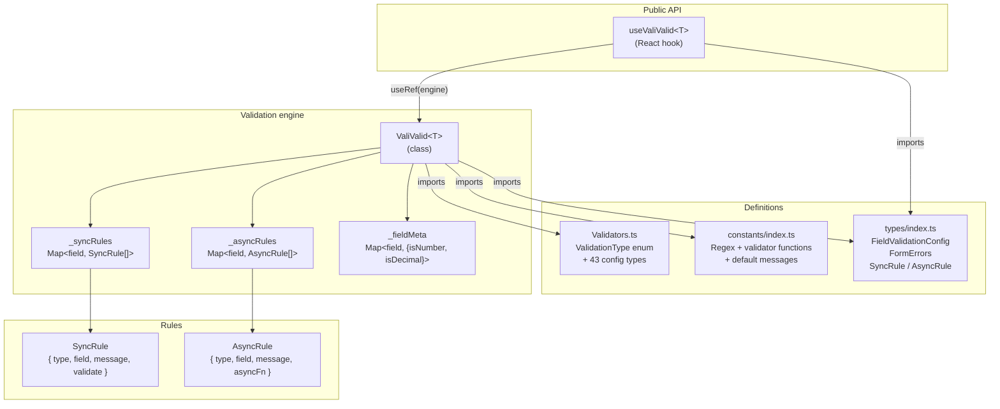
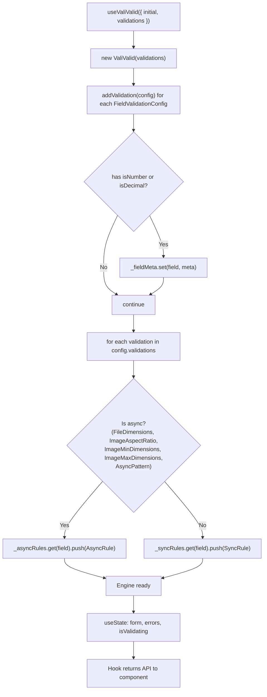
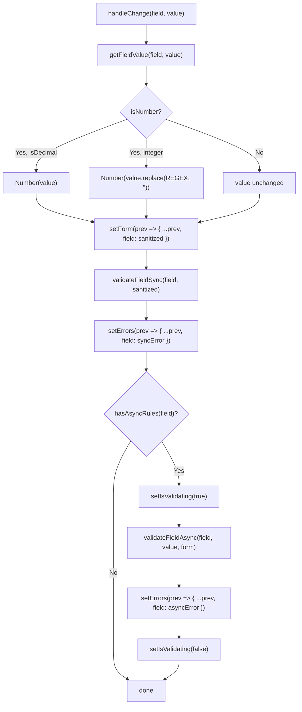
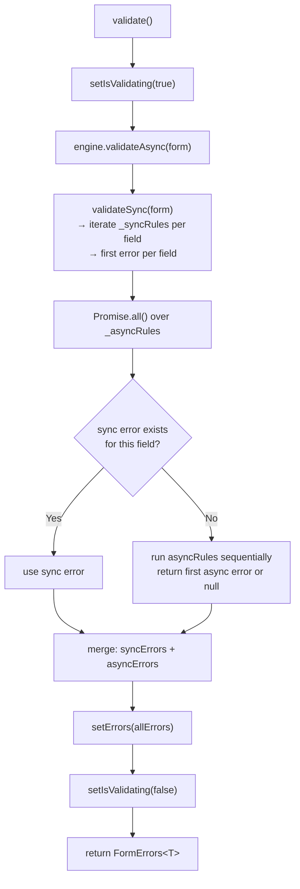
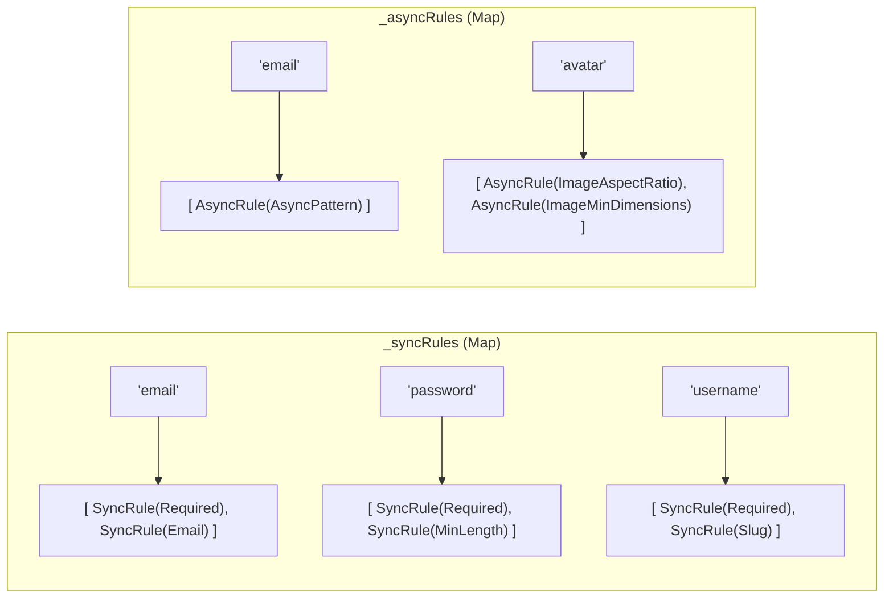
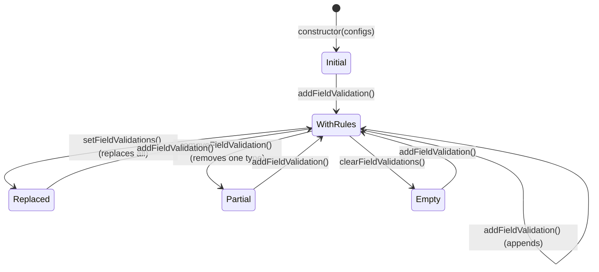

# Internal architecture

Technical overview of how ValiValid v2 works internally, with layer diagrams, execution flows, and data structures.

---

## System layers



---

## File structure

```
src/
├── index.ts                  ← Public re-exports
├── types/
│   └── index.ts              ← Types: FormErrors, FieldValidationConfig, SyncRule, AsyncRule, enums
├── constants/
│   └── index.ts              ← Regex, validator functions, default error messages
├── validation/
│   ├── Validators.ts         ← ValidationType enum + 43 config types
│   └── ValiValid.ts          ← Engine: rule storage and execution
└── hooks/
    └── useValiValid.ts       ← React hook: state + lifecycle
```

---

## Initialization flow



---

## `handleChange` flow



---

## Full `validate()` flow



---

## Rule storage (Map)



---

## Dynamic rule management



---

## Design decisions

| Decision | Reason |
|----------|--------|
| Engine decoupled from hook | Enables use without React (Node.js, testing) |
| Two separate Maps (sync/async) | Efficient execution — no filtering needed per validation run |
| First-error-only per field | Better UX — user sees one error at a time |
| `asyncFn(value, form)` always receives both | Avoids `.length` detection (fragile with minifiers) |
| `_currentForm` internal reference | Cross-field sync without passing form to every individual rule |
| `useRef` for engine in hook | Persists across renders without causing re-renders |
| `isValidating` in hook, not engine | Engine is React-agnostic; hook manages UI state |
