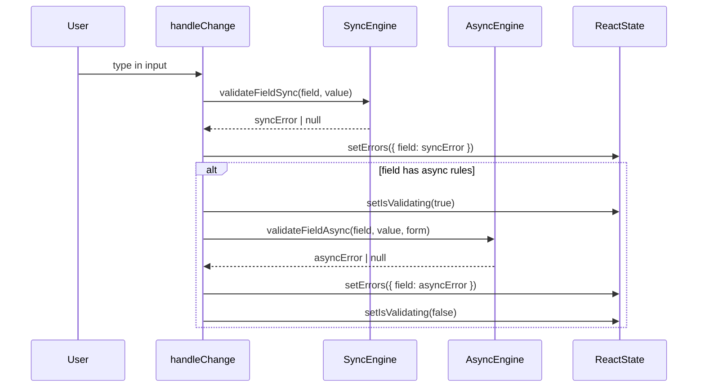

# Async validation

ValiValid v2 has first-class support for async validation rules. They run after all sync rules pass for a field, and the hook exposes `isValidating` to track progress.

---

## How it works



**Key behaviors:**
- Sync runs first — if sync fails, async is **skipped** for that field
- `isValidating` is `true` only while async is pending
- `validate()` always runs full async for all fields

---

## `AsyncPattern`

The most flexible async type. Provide an `asyncFn` that returns `Promise<boolean>` (`true` = valid).

```ts
{
  type: ValidationType.AsyncPattern,
  message: 'Custom error message',
  asyncFn: (value: any, form: Record<string, any>) => Promise<boolean>
}
```

`asyncFn` receives:
- `value` — current field value (already sanitized)
- `form` — the entire current form object

### Example: check username availability

```tsx
import { rule } from 'vali-valid';

{
  field: 'username',
  validations: rule()
    .required()
    .minLength(3)
    .slug()
    .asyncPattern(
      async (value) => {
        const res = await fetch(`/api/users/check?username=${encodeURIComponent(value)}`);
        const data = await res.json();
        return data.available;
      },
      'Username is already taken.',
    )
    .build(),
}
```

### Example: validate coupon with form context

```tsx
import { rule, ValidationType } from 'vali-valid';

{
  field: 'coupon',
  // traditional form — also valid
  validations: [
    {
      type: ValidationType.AsyncPattern,
      message: 'Coupon is not valid for this product.',
      asyncFn: async (value, form) => {
        const res = await fetch('/api/coupons/validate', {
          method: 'POST',
          body: JSON.stringify({ coupon: value, productId: form.productId }),
          headers: { 'Content-Type': 'application/json' },
        });
        return res.ok;
      },
    },
  ],
}
```

---

## Async image validators

| Type | Description |
|------|-------------|
| `FileDimensions` | Exact width and height |
| `ImageAspectRatio` | Width-to-height ratio with optional tolerance |
| `ImageMinDimensions` | Minimum width and/or height |
| `ImageMaxDimensions` | Maximum width and/or height |

### Example: profile picture

```tsx
import { rule, TypeFile, FileSize } from 'vali-valid';

{
  field: 'avatar',
  validations: rule()
    .required()
    .fileType([TypeFile.JPG, TypeFile.PNG])
    .fileSize(FileSize['5MB'])
    .imageAspectRatio({ width: 1, height: 1 }, 0.01, 'Profile picture must be square.')
    .imageMinDimensions({ width: 400, height: 400 }, 'Minimum size is 400×400 px.')
    .build(),
}
```

---

## `isValidating` UX pattern

```tsx
<div className="field">
  <input onChange={(e) => handleChange('email', e.target.value)} />
  {isValidating ? (
    <span className="hint">Checking…</span>
  ) : (
    errors.email && <span className="error">{errors.email}</span>
  )}
</div>

<button type="submit" disabled={isValidating}>
  {isValidating ? 'Please wait…' : 'Submit'}
</button>
```

---

## Debouncing async validation

```tsx
import { useMemo } from 'react';
import { debounce } from 'lodash-es';

const debouncedChange = useMemo(
  () => debounce((field, value) => handleChange(field, value), 400),
  [handleChange]
);

<input onChange={(e) => debouncedChange('email', e.target.value)} />
```
