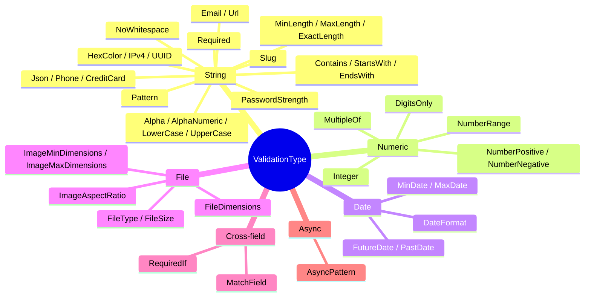

# Validators reference

All 43 validation types available in ValiValid v2, organized by category.

---

## Categories



---

## String (23 types)

| Type | Parameters | Description |
|------|-----------|-------------|
| `Required` | — | Non-empty string, any number (incl. `0`), boolean, File, Date, non-empty array |
| `MinLength` | `value: number` | String length ≥ value |
| `MaxLength` | `value: number` | String length ≤ value |
| `ExactLength` | `value: number` | String length === value |
| `Email` | — | Regex `user@domain.ext` |
| `Url` | — | http / https / ftp + valid domain |
| `Alpha` | — | Letters only (a-zA-Z), no spaces |
| `AlphaNumeric` | — | Letters + digits, no spaces or symbols |
| `LowerCase` | — | Lowercase letters only (a-z) |
| `UpperCase` | — | Uppercase letters only (A-Z) |
| `NoWhitespace` | — | No spaces anywhere |
| `Contains` | `value: string` | Must include the substring |
| `StartsWith` | `value: string` | Must begin with the prefix |
| `EndsWith` | `value: string` | Must end with the suffix |
| `Slug` | — | Lowercase letters, digits, hyphens — no leading/trailing hyphens |
| `PasswordStrength` | — | ≥8 chars, uppercase, lowercase, digit, special char |
| `HexColor` | — | `#RGB` or `#RRGGBB` |
| `IPv4` | — | Valid IPv4 address (0-255 per octet) |
| `UUID` | — | UUID v4 format |
| `Json` | — | Parseable by `JSON.parse()` |
| `Phone` | — | International format: optional `+`, 7-15 digits |
| `CreditCard` | — | Luhn algorithm, 13-19 digits |
| `Pattern` | `value: (v: any) => boolean` | Custom sync function |

### Examples

```ts
{ type: ValidationType.Required }
{ type: ValidationType.MinLength, value: 8 }
{ type: ValidationType.MaxLength, value: 100 }
{ type: ValidationType.ExactLength, value: 6 }  // PIN, OTP code
{ type: ValidationType.Email }
{ type: ValidationType.Url }
{ type: ValidationType.Alpha }
{ type: ValidationType.AlphaNumeric }
{ type: ValidationType.LowerCase }
{ type: ValidationType.UpperCase }
{ type: ValidationType.NoWhitespace }
{ type: ValidationType.Contains, value: '@company.com' }
{ type: ValidationType.StartsWith, value: 'REF-' }
{ type: ValidationType.EndsWith, value: '.pdf' }
{ type: ValidationType.Slug }
{ type: ValidationType.PasswordStrength }
{ type: ValidationType.HexColor }         // #fff, #1a2b3c
{ type: ValidationType.IPv4 }             // 192.168.1.1
{ type: ValidationType.UUID }
{ type: ValidationType.Json }
{ type: ValidationType.Phone }
{ type: ValidationType.CreditCard }
{ type: ValidationType.Pattern, value: (v) => /^[A-Z]{2}-\d{4}$/.test(v) }
```

---

## Numeric (6 types)

> Combine with `isNumber: true` or `isDecimal: true` in `FieldValidationConfig` for automatic sanitization.

| Type | Parameters | Description |
|------|-----------|-------------|
| `DigitsOnly` | — | Only digits 0-9 (no sign, no decimals) |
| `NumberRange` | `value: [min, max]` | min ≤ value ≤ max |
| `NumberPositive` | — | value > 0 |
| `NumberNegative` | — | value < 0 |
| `Integer` | — | `Number.isInteger(value)` |
| `MultipleOf` | `value: number` | `value % n === 0` |

```ts
{ type: ValidationType.DigitsOnly }
{ type: ValidationType.NumberRange, value: [18, 65] }
{ type: ValidationType.NumberPositive }
{ type: ValidationType.NumberNegative }
{ type: ValidationType.Integer }
{ type: ValidationType.MultipleOf, value: 5 }
```

---

## Date (5 types)

Values are parsed via `new Date(value)` — accepts ISO strings, timestamps, and `Date` objects.

| Type | Parameters | Description |
|------|-----------|-------------|
| `DateFormat` | `format: DateFormat` | Regex match for the chosen format |
| `MinDate` | `value: string \| Date` | date ≥ minDate |
| `MaxDate` | `value: string \| Date` | date ≤ maxDate |
| `FutureDate` | — | date > now |
| `PastDate` | — | date < now |

```ts
import { DateFormat } from 'vali-valid';

{ type: ValidationType.DateFormat, format: DateFormat['DD/MM/YYYY'] }
{ type: ValidationType.MinDate, value: '2000-01-01' }
{ type: ValidationType.MaxDate, value: new Date() }
{ type: ValidationType.FutureDate }
{ type: ValidationType.PastDate }
```

---

## File (6 types)

> `FileDimensions`, `ImageAspectRatio`, `ImageMinDimensions`, `ImageMaxDimensions` are **async** (use `Image.decode()`).

| Type | Parameters | Description |
|------|-----------|-------------|
| `FileType` | `value: TypeFile[] \| string[]` | MIME type whitelist |
| `FileSize` | `value: number \| FileSize` | Max bytes |
| `FileDimensions` _(async)_ | `value: { width, height }` | Exact pixel dimensions |
| `ImageAspectRatio` _(async)_ | `value: { width, height }`, `tolerance?` | Ratio check (default ±1%) |
| `ImageMinDimensions` _(async)_ | `value: { width?, height? }` | Min pixels (either or both) |
| `ImageMaxDimensions` _(async)_ | `value: { width?, height? }` | Max pixels (either or both) |

```ts
import { TypeFile, FileSize } from 'vali-valid';

{ type: ValidationType.FileType, value: [TypeFile.JPG, TypeFile.PNG] }
{ type: ValidationType.FileSize, value: FileSize['5MB'] }
{ type: ValidationType.FileDimensions, value: { width: 1200, height: 628 } }
{ type: ValidationType.ImageAspectRatio, value: { width: 16, height: 9 }, tolerance: 0.02 }
{ type: ValidationType.ImageMinDimensions, value: { width: 400, height: 400 } }
{ type: ValidationType.ImageMaxDimensions, value: { width: 4096 } }  // width only
```

---

## Cross-field (2 types)

### `MatchField`

Field value must equal another field's value. Perfect for confirm-password patterns.

```ts
{
  field: 'confirmPassword',
  validations: [
    { type: ValidationType.Required },
    {
      type: ValidationType.MatchField,
      field: 'password',
      message: 'Passwords do not match.',
    },
  ],
}
```

### `RequiredIf`

Field is required only when a condition on the entire form is true.

```ts
{
  field: 'address',
  validations: [
    {
      type: ValidationType.RequiredIf,
      condition: (form) => form.shippingMethod === 'home',
      message: 'Address is required for home delivery.',
    },
  ],
}
```

---

## Async (1 type)

### `AsyncPattern`

`asyncFn` must return `Promise<boolean>` — `true` = valid, `false` = invalid.

```ts
{
  type: ValidationType.AsyncPattern,
  message: 'Email is already registered.',
  asyncFn: async (value, form) => {
    const res = await fetch(`/api/check-email?email=${value}`);
    const data = await res.json();
    return data.available;
  },
}
```

See [async.md](./async.md) for full async documentation.

---

## Default error messages

| Validator | Default message |
|-----------|----------------|
| `Required` | `Required field.` |
| `MinLength` | `The field must have at least {n} characters.` |
| `MaxLength` | `The field cannot be more than {n} characters.` |
| `ExactLength` | `The field must be exactly {n} characters.` |
| `Email` | `Does not have email format.` |
| `Url` | `Invalid url format.` |
| `Alpha` | `Only supports letters.` |
| `AlphaNumeric` | `Only supports letters and numbers.` |
| `LowerCase` | `Only supports lowercase letters.` |
| `UpperCase` | `Only supports uppercase letters.` |
| `NoWhitespace` | `The field must not contain spaces.` |
| `Contains` | `The field must contain "{v}".` |
| `StartsWith` | `The field must start with "{v}".` |
| `EndsWith` | `The field must end with "{v}".` |
| `Slug` | `Only lowercase letters, numbers, and hyphens are allowed.` |
| `PasswordStrength` | `Password must include uppercase, lowercase, number, and special character.` |
| `HexColor` | `Invalid hex color format.` |
| `IPv4` | `Invalid IPv4 address.` |
| `UUID` | `Invalid UUID format.` |
| `Json` | `Invalid JSON format.` |
| `Phone` | `Invalid phone number format.` |
| `CreditCard` | `Invalid credit card number.` |
| `Pattern` | `Does not comply with the required pattern.` |
| `DigitsOnly` | `The field can only contain digits.` |
| `NumberRange` | `The value must be between {min} and {max}.` |
| `NumberPositive` | `Only positive numbers are allowed.` |
| `NumberNegative` | `Only negative numbers are allowed.` |
| `Integer` | `The field must be an integer.` |
| `MultipleOf` | `The value must be a multiple of {n}.` |
| `DateFormat` | `The date format is invalid. The expected format is ({format}).` |
| `MinDate` | `The date must be on or after {v}.` |
| `MaxDate` | `The date must be on or before {v}.` |
| `FutureDate` | `The date must be in the future.` |
| `PastDate` | `The date must be in the past.` |
| `FileType` | `File type not allowed.` |
| `FileSize` | `The file size exceeds the allowed limit.` |
| `FileDimensions` | `The file dimensions must be {w}x{h}.` |
| `ImageAspectRatio` | `The image aspect ratio must be {w}:{h}.` |
| `ImageMinDimensions` | `The image dimensions must be at least width >= {w}px and height >= {h}px.` |
| `ImageMaxDimensions` | `The image dimensions must be at most width <= {w}px and height <= {h}px.` |
| `MatchField` | `Fields do not match.` |
| `RequiredIf` | `This field is required.` |
| `AsyncPattern` | `Validation failed.` |
