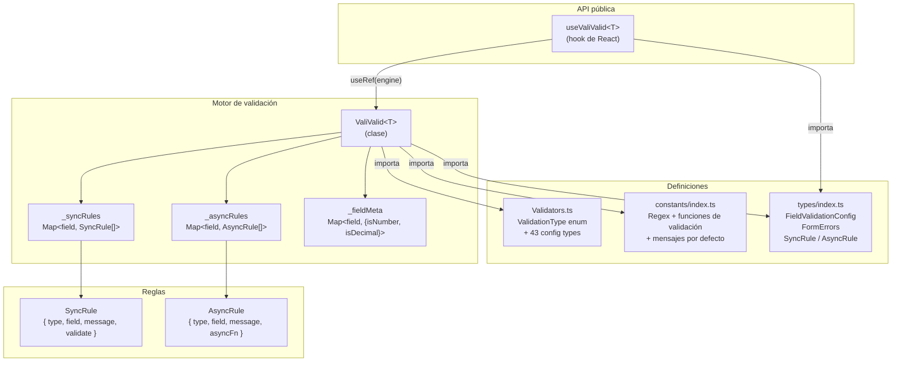
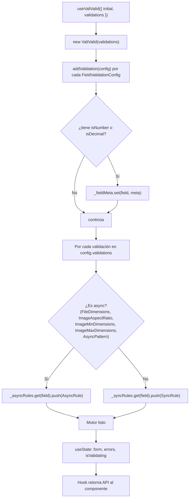
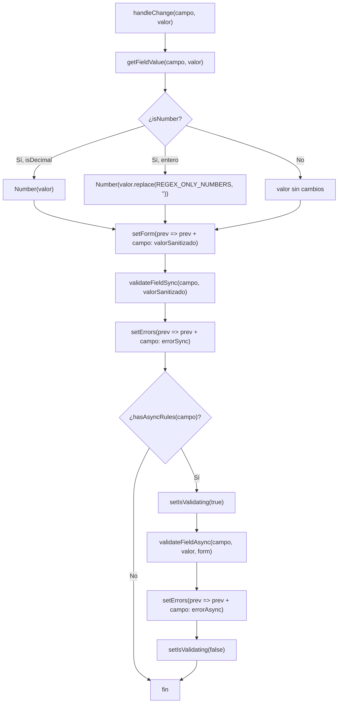
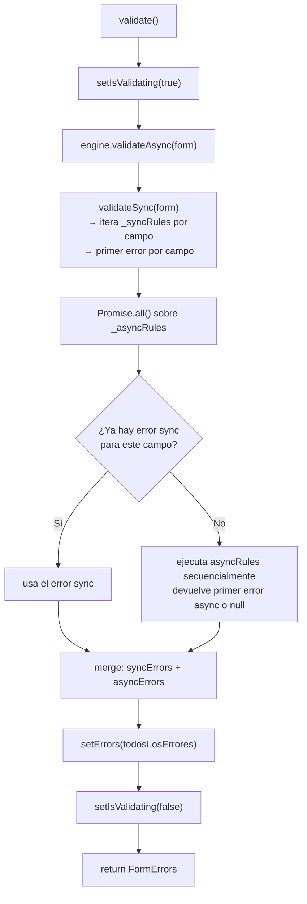
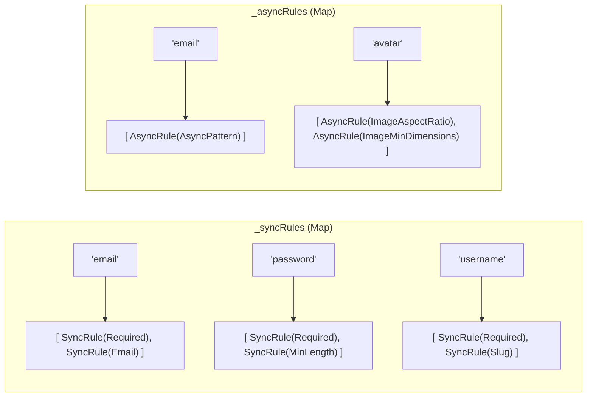
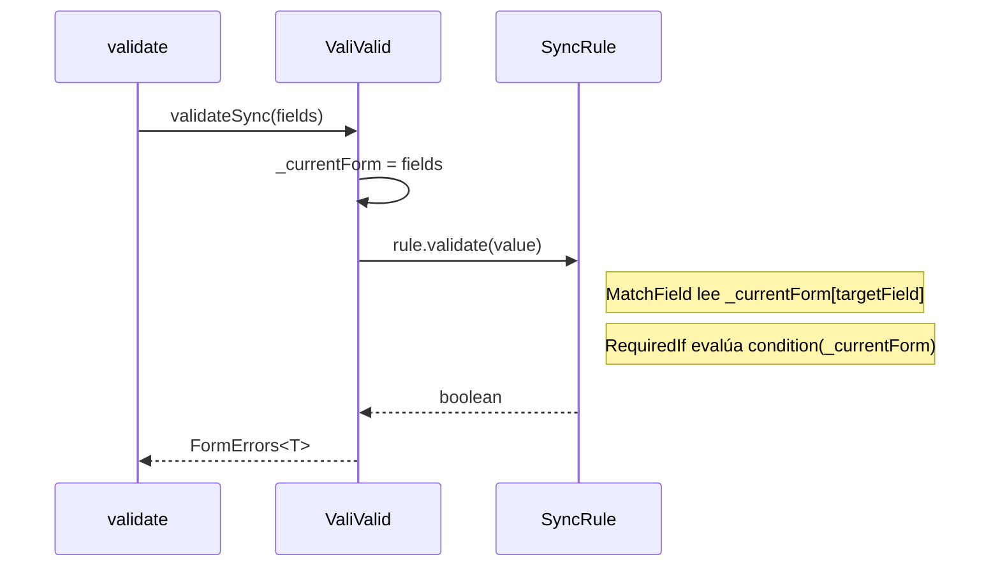
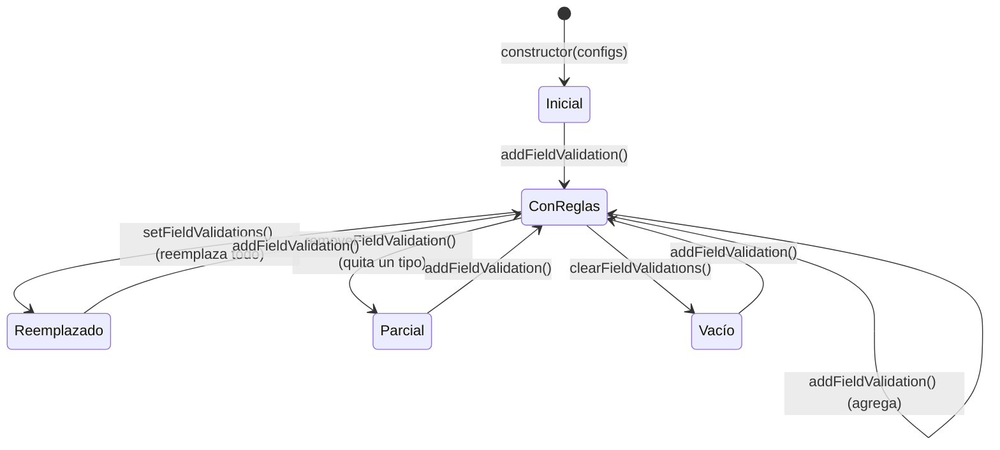
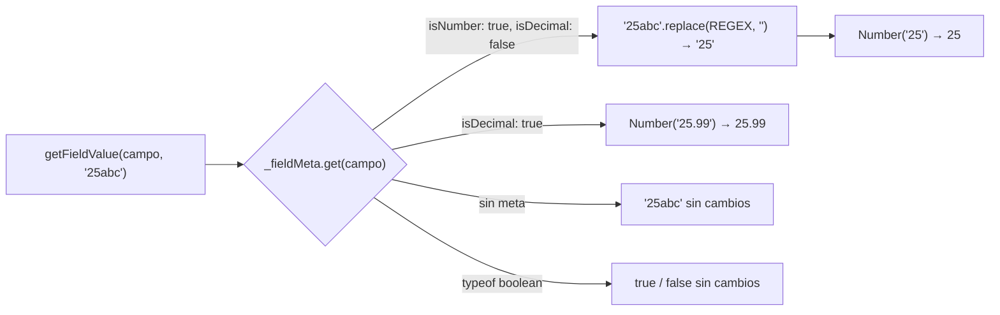

# Arquitectura interna

Descripción técnica de cómo funciona ValiValid v2 por dentro, con diagramas de capas, flujos de ejecución y estructura de datos.

---

## Capas del sistema



---

## Estructura de archivos

```
src/
├── index.ts                  ← Re-exports públicos
├── types/
│   └── index.ts              ← Tipos: FormErrors, FieldValidationConfig, SyncRule, AsyncRule, enums
├── constants/
│   └── index.ts              ← Regex, funciones de validación, mensajes de error
├── validation/
│   ├── Validators.ts         ← ValidationType enum + 43 tipos de configuración
│   └── ValiValid.ts          ← Motor: almacenamiento y ejecución de reglas
└── hooks/
    └── useValiValid.ts       ← Hook de React: estado + ciclo de vida
```

---

## Flujo de inicialización



---

## Flujo de `handleChange`



---

## Flujo de `validate()` (formulario completo)



---

## Estructura interna de reglas

### Regla síncrona

```ts
type SyncRule<T> = {
  type: string;                       // ValidationType value (ej: 'Email')
  field: keyof T;                     // campo al que pertenece (ej: 'email')
  message: string;                    // mensaje de error si falla
  validate: (value: any) => boolean;  // función pura de validación
};
```

**Ejemplo generado para `{ type: ValidationType.Email }`:**

```ts
{
  type: 'Email',
  field: 'email',
  message: 'Does not have email format.',
  validate: (value) => /^[^\s@]+@[^\s@]+\.[^\s@]+$/.test(value),
}
```

### Regla asíncrona

```ts
type AsyncRule<T> = {
  type: string;
  field: keyof T;
  message: string;
  asyncFn: (value: any, form: T) => Promise<boolean>;
};
```

**Ejemplo generado para `{ type: ValidationType.FileDimensions, value: { width: 1200, height: 628 } }`:**

```ts
{
  type: 'FileDimensions',
  field: 'banner',
  message: 'The file dimensions must be 1200x628.',
  asyncFn: (file) => validateImageDimensions(file, { width: 1200, height: 628 }),
}
```

---

## Almacenamiento de reglas (Map)



---

## Validación cross-field

`MatchField` y `RequiredIf` necesitan acceso al formulario completo durante la validación. El motor usa una referencia interna `_currentForm` que se actualiza en cada llamada a `validateSync` o `validateAsync`.



---

## Gestión dinámica de reglas



---

## Sanitización de valores numéricos



---

## Decisiones de diseño

| Decisión | Razón |
|----------|-------|
| Motor separado del hook | Permite uso sin React (Node.js, testing, clase) |
| Dos Maps separados (sync/async) | Ejecución más eficiente — no hay que filtrar en cada validación |
| Primer error únicamente por campo | Mejor UX — el usuario ve un error a la vez |
| `asyncFn(value, form)` siempre recibe ambos | Evita detección por `.length` (frágil con minificadores) |
| `_currentForm` como referencia interna | Cross-field sync sin pasar el form a cada regla individual |
| `useRef` para el motor en el hook | Persiste entre renders sin causar re-renders |
| `isValidating` en el hook, no en el motor | El motor es agnóstico de React; el hook gestiona el estado de UI |
