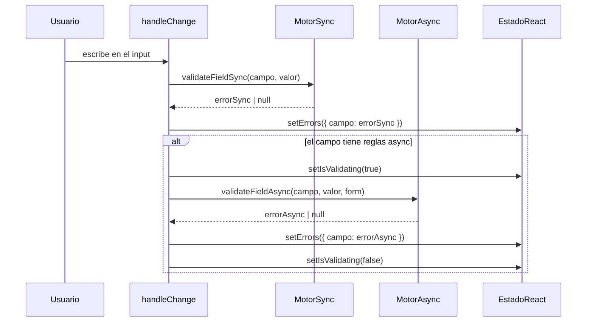

# Validación asíncrona

ValiValid v2 tiene soporte nativo para reglas de validación asíncronas. Se ejecutan después de que todas las reglas síncronas de un campo pasen, y el hook expone `isValidating` para rastrear el progreso.

---

## Cómo funciona



**Comportamientos clave:**
- Las reglas síncronas se ejecutan primero — si la sync falla, la async se **omite** para ese campo
- `isValidating` es `true` solo mientras hay una operación async pendiente
- `validate()` siempre ejecuta la validación async completa para todos los campos

---

## `AsyncPattern`

El tipo async más flexible. Proporciona una `asyncFn` que retorna `Promise<boolean>` (`true` = válido).

```ts
{
  type: ValidationType.AsyncPattern,
  message: 'Mensaje de error personalizado',
  asyncFn: (value: any, form: Record<string, any>) => Promise<boolean>
}
```

`asyncFn` recibe:
- `value` — el valor actual del campo (ya sanitizado por `getFieldValue`)
- `form` — el objeto completo del formulario actual (útil para lógica cross-field)

### Ejemplo: verificar disponibilidad de nombre de usuario

```tsx
{
  field: 'username',
  validations: [
    { type: ValidationType.Required },
    { type: ValidationType.MinLength, value: 3 },
    { type: ValidationType.Slug },
    {
      type: ValidationType.AsyncPattern,
      message: 'Este nombre de usuario ya está en uso.',
      asyncFn: async (value) => {
        const res = await fetch(`/api/usuarios/verificar?username=${encodeURIComponent(value)}`);
        const data = await res.json();
        return data.disponible; // true = válido
      },
    },
  ],
}
```

### Ejemplo: validar cupón con contexto del formulario

```tsx
{
  field: 'cupon',
  validations: [
    {
      type: ValidationType.AsyncPattern,
      message: 'Cupón no válido para este producto.',
      asyncFn: async (value, form) => {
        const res = await fetch('/api/cupones/validar', {
          method: 'POST',
          body: JSON.stringify({ cupon: value, productoId: form.productoId }),
          headers: { 'Content-Type': 'application/json' },
        });
        return res.ok;
      },
    },
  ],
}
```

---

## Validadores de imagen (async)

Los siguientes tipos también son asíncronos — usan la API del navegador `Image.decode()`:

| Tipo | Descripción |
|------|-------------|
| `FileDimensions` | Ancho y alto exactos |
| `ImageAspectRatio` | Relación ancho/alto con tolerancia opcional |
| `ImageMinDimensions` | Dimensiones mínimas de ancho y/o alto |
| `ImageMaxDimensions` | Dimensiones máximas de ancho y/o alto |

Se configuran como cualquier otra regla — el manejo asíncrono es transparente.

### Ejemplo: restricciones de foto de perfil

```tsx
{
  field: 'avatar',
  validations: [
    { type: ValidationType.Required },
    { type: ValidationType.FileType, value: [TypeFile.JPG, TypeFile.PNG] },
    { type: ValidationType.FileSize, value: FileSize['5MB'] },

    // Debe ser 1:1 (cuadrado) con ±1% de tolerancia
    {
      type: ValidationType.ImageAspectRatio,
      value: { width: 1, height: 1 },
      tolerance: 0.01,
      message: 'La foto de perfil debe ser cuadrada.',
    },

    // Al menos 400×400 px
    {
      type: ValidationType.ImageMinDimensions,
      value: { width: 400, height: 400 },
      message: 'El tamaño mínimo es 400×400 px.',
    },

    // No más de 2000×2000 px
    {
      type: ValidationType.ImageMaxDimensions,
      value: { width: 2000, height: 2000 },
      message: 'El tamaño máximo es 2000×2000 px.',
    },
  ],
}
```

### Ejemplo: banner con dimensiones exactas

```tsx
{
  field: 'banner',
  validations: [
    { type: ValidationType.FileType, value: [TypeFile.JPG, TypeFile.PNG] },
    {
      type: ValidationType.FileDimensions,
      value: { width: 1200, height: 628 },
      message: 'El banner debe ser exactamente 1200×628 px.',
    },
  ],
}
```

---

## Patrón UX con `isValidating`

```tsx
const { isValidating, errors } = useValiValid(…);

// En el campo:
<div className="campo">
  <input onChange={(e) => handleChange('email', e.target.value)} />
  {isValidating ? (
    <span className="hint">Verificando…</span>
  ) : (
    errors.email && <span className="error">{errors.email}</span>
  )}
</div>

// Botón de envío:
<button type="submit" disabled={isValidating}>
  {isValidating ? 'Por favor espera…' : 'Enviar'}
</button>
```

---

## `validate()` completo con async

```tsx
const handleSubmit = async (e: React.FormEvent) => {
  e.preventDefault();

  // Ejecuta TODAS las reglas sync + async para cada campo
  const errores = await validate();

  const hayErrores = Object.values(errores).some(Boolean);
  if (hayErrores) return;

  await enviarFormulario(form);
};
```

---

## Consideraciones de rendimiento

Las reglas async se ejecutan en cada `handleChange`. Si el usuario escribe rápido, pueden estar en vuelo varias solicitudes simultáneamente. Para debouncing, envuelve `handleChange` con una utilidad de debounce:

```tsx
import { useMemo } from 'react';
import { debounce } from 'lodash-es';

const handleChangeDebounced = useMemo(
  () => debounce((campo, valor) => handleChange(campo, valor), 400),
  [handleChange]
);

<input onChange={(e) => handleChangeDebounced('email', e.target.value)} />
```
