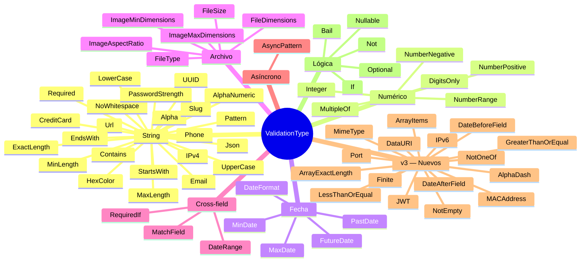

# Referencia de validadores

Los 74+ tipos de validación disponibles en ValiValid v3.1.0, organizados por categoría.

---

## Categorías



---

## String (23 tipos)

### `Required`
Campo obligatorio. Acepta: strings no vacíos, cualquier número (incluido `0`), booleanos, `File`, `Date`, arrays no vacíos.

```ts
{ type: ValidationType.Required }
{ type: ValidationType.Required, message: 'Este campo es obligatorio.' }
```

---

### `MinLength`
Longitud mínima de caracteres.

```ts
{ type: ValidationType.MinLength, value: 3 }
{ type: ValidationType.MinLength, value: 8, message: 'Mínimo 8 caracteres.' }
```

---

### `MaxLength`
Longitud máxima de caracteres.

```ts
{ type: ValidationType.MaxLength, value: 50 }
{ type: ValidationType.MaxLength, value: 160, message: 'Máximo 160 caracteres.' }
```

---

### `ExactLength`
Longitud exacta requerida.

```ts
{ type: ValidationType.ExactLength, value: 8 }
// Ej: códigos postales, PINs, códigos de verificación
```

---

### `Email`
Formato de email válido.

```ts
{ type: ValidationType.Email }
{ type: ValidationType.Email, message: 'Ingresa un email válido.' }
// ✅ usuario@dominio.com
// ❌ usuario@, @dominio.com
```

---

### `Url`
URL válida (http, https o ftp).

```ts
{ type: ValidationType.Url }
// ✅ https://ejemplo.com, http://sub.dominio.org/ruta
// ❌ www.ejemplo.com (sin protocolo)
```

---

### `Alpha`
Solo letras (mayúsculas y minúsculas, sin espacios ni números).

```ts
{ type: ValidationType.Alpha }
// ✅ Alicia, JUAN
// ❌ Juan123, Juan García
```

---

### `AlphaNumeric`
Solo letras y números (sin espacios ni caracteres especiales).

```ts
{ type: ValidationType.AlphaNumeric }
// ✅ usuario123, ABC
// ❌ user_123, user name
```

---

### `LowerCase`
Solo letras minúsculas (sin espacios).

```ts
{ type: ValidationType.LowerCase }
// ✅ hola, mundo
// ❌ Hola, MUNDO
```

---

### `UpperCase`
Solo letras mayúsculas (sin espacios).

```ts
{ type: ValidationType.UpperCase }
// ✅ HOLA, MUNDO
// ❌ Hola, hola
```

---

### `NoWhitespace`
Sin espacios en blanco en ninguna posición.

```ts
{ type: ValidationType.NoWhitespace }
// ✅ usuario123, mi-contraseña
// ❌ "mi usuario", "contra seña"
```

---

### `Contains`
El valor debe contener una subcadena específica.

```ts
{ type: ValidationType.Contains, value: '@empresa.com' }
{ type: ValidationType.Contains, value: 'REF-', message: 'Debe contener el prefijo REF-.' }
// ✅ usuario@empresa.com
// ❌ usuario@gmail.com
```

---

### `StartsWith`
El valor debe comenzar con un prefijo específico.

```ts
{ type: ValidationType.StartsWith, value: 'https://' }
{ type: ValidationType.StartsWith, value: 'ES-', message: 'El código debe comenzar con ES-.' }
```

---

### `EndsWith`
El valor debe terminar con un sufijo específico.

```ts
{ type: ValidationType.EndsWith, value: '.pdf' }
{ type: ValidationType.EndsWith, value: '@mi-empresa.com', message: 'Usa tu email corporativo.' }
```

---

### `Slug`
Formato slug de URL: solo letras minúsculas, números y guiones. Sin guiones al inicio o al final, sin dobles guiones.

```ts
{ type: ValidationType.Slug }
// ✅ mi-articulo, post-123, producto-azul
// ❌ Mi Artículo, -post, post--123
```

---

### `PasswordStrength`
Contraseña fuerte: mínimo 8 caracteres, una mayúscula, una minúscula, un número y un carácter especial.

```ts
{ type: ValidationType.PasswordStrength }
{ type: ValidationType.PasswordStrength, message: 'La contraseña es demasiado débil.' }
// ✅ Seguro@123, MiC0ntr@señ4
// ❌ password, 12345678, PASSWORD1
```

---

### `HexColor`
Color hexadecimal válido con `#`. Acepta formato corto (#RGB) y largo (#RRGGBB).

```ts
{ type: ValidationType.HexColor }
// ✅ #fff, #FFF, #1a2b3c, #FFFFFF
// ❌ fff, #xyz, #12345
```

---

### `IPv4`
Dirección IPv4 válida.

```ts
{ type: ValidationType.IPv4 }
// ✅ 192.168.1.1, 10.0.0.1, 255.255.255.0
// ❌ 256.1.1.1, 192.168.1, 1.2.3.4.5
```

---

### `UUID`
UUID v4 válido.

```ts
{ type: ValidationType.UUID }
// ✅ 550e8400-e29b-41d4-a716-446655440000
// ❌ 550e8400-e29b-11d4-a716-446655440000 (v1, no v4)
```

---

### `Json`
String JSON válido (parseable por `JSON.parse`).

```ts
{ type: ValidationType.Json }
// ✅ '{"nombre":"Juan"}', '[1,2,3]', '"texto"'
// ❌ '{nombre: Juan}', 'texto sin comillas'
```

---

### `Phone`
Número de teléfono en formato internacional. Acepta `+` al inicio, seguido de 7 a 15 dígitos (los espacios se ignoran).

```ts
{ type: ValidationType.Phone }
// ✅ +541112345678, +1234567890, 12345678
// ❌ +0123456789 (no puede empezar con 0 después de +)
```

---

### `CreditCard`
Número de tarjeta de crédito válido según el algoritmo de Luhn. Acepta entre 13 y 19 dígitos (los espacios y guiones se ignoran).

```ts
{ type: ValidationType.CreditCard }
// ✅ 4532015112830366 (Visa), 5425233430109903 (Mastercard)
// ❌ 1234567890123456 (falla Luhn)
```

---

### `Pattern`
Validación personalizada con una función sincrónica.

```ts
{
  type: ValidationType.Pattern,
  value: (valor) => /^[A-Z]{2}-\d{4}$/.test(valor),
  message: 'Formato esperado: XX-0000 (ej: AR-1234).',
}
```

---

## Numérico (6 tipos)

> Combina con `isNumber: true` o `isDecimal: true` en `FieldValidationConfig` para sanitizar el valor automáticamente.

### `DigitsOnly`
Solo dígitos (0-9), sin signos ni decimales.

```ts
{ type: ValidationType.DigitsOnly }
// ✅ "123", "007"
// ❌ "12.3", "-5", "1a2"
```

---

### `NumberRange`
El valor debe estar dentro de un rango `[min, max]` (inclusive).

```ts
{ type: ValidationType.NumberRange, value: [18, 99] }
{ type: ValidationType.NumberRange, value: [0, 100], message: 'Ingresa un porcentaje entre 0 y 100.' }
```

---

### `NumberPositive`
Solo números positivos (mayores a 0).

```ts
{ type: ValidationType.NumberPositive }
// ✅ 1, 0.01, 100
// ❌ 0, -1, -100
```

---

### `NumberNegative`
Solo números negativos (menores a 0).

```ts
{ type: ValidationType.NumberNegative }
// ✅ -1, -0.5
// ❌ 0, 1
```

---

### `Integer`
El valor debe ser un número entero (sin decimales).

```ts
{ type: ValidationType.Integer }
// ✅ 1, 0, -5, 100
// ❌ 1.5, 3.14
```

---

### `MultipleOf`
El valor debe ser múltiplo de N.

```ts
{ type: ValidationType.MultipleOf, value: 5 }
{ type: ValidationType.MultipleOf, value: 0.25, message: 'Solo cuartos de unidad.' }
// ✅ 0, 5, 10, 15, 100
// ❌ 3, 7, 11
```

---

## Fecha (5 tipos)

Los valores de fecha se convierten con `new Date(value)`, por lo que aceptan strings ISO, timestamps y objetos `Date`.

### `DateFormat`
El string debe coincidir con el formato especificado.

```ts
import { DateFormat } from 'vali-valid';

{ type: ValidationType.DateFormat, format: DateFormat['DD/MM/YYYY'] }
// ✅ "25/12/2024"
// ❌ "2024-12-25", "25-12-2024"
```

| Formato | Ejemplo |
|---------|---------|
| `'YYYY-MM-DD'` | 2024-12-25 |
| `'DD-MM-YYYY'` | 25-12-2024 |
| `'YYYY/MM/DD'` | 2024/12/25 |
| `'DD/MM/YYYY'` | 25/12/2024 |

---

### `MinDate`
La fecha debe ser igual o posterior a la fecha mínima.

```ts
{ type: ValidationType.MinDate, value: '2000-01-01' }
{ type: ValidationType.MinDate, value: new Date('2020-01-01'), message: 'Solo fechas desde 2020.' }
```

---

### `MaxDate`
La fecha debe ser igual o anterior a la fecha máxima.

```ts
{ type: ValidationType.MaxDate, value: '2024-12-31' }
{ type: ValidationType.MaxDate, value: new Date(), message: 'No puede ser una fecha futura.' }
```

---

### `FutureDate`
La fecha debe ser posterior al momento actual.

```ts
{ type: ValidationType.FutureDate }
{ type: ValidationType.FutureDate, message: 'La fecha de vencimiento debe ser futura.' }
```

---

### `PastDate`
La fecha debe ser anterior al momento actual.

```ts
{ type: ValidationType.PastDate }
{ type: ValidationType.PastDate, message: 'La fecha de nacimiento debe ser pasada.' }
```

---

## Archivo (6 tipos)

> `FileDimensions`, `ImageAspectRatio`, `ImageMinDimensions` e `ImageMaxDimensions` son **asíncronos** (usan `Image.decode()`).

### `FileType`
El tipo MIME del archivo debe estar en la lista permitida.

```ts
import { TypeFile } from 'vali-valid';

{ type: ValidationType.FileType, value: [TypeFile.JPG, TypeFile.PNG] }
{ type: ValidationType.FileType, value: [TypeFile.PDF, TypeFile.DOCX], message: 'Solo se permiten PDF y DOCX.' }

// También acepta strings MIME directamente:
{ type: ValidationType.FileType, value: ['image/webp', 'image/gif'] }
```

---

### `FileSize`
El tamaño del archivo no debe superar el límite máximo.

```ts
import { FileSize } from 'vali-valid';

{ type: ValidationType.FileSize, value: FileSize['5MB'] }
{ type: ValidationType.FileSize, value: FileSize['500KB'], message: 'El archivo no puede superar 500 KB.' }

// También acepta bytes directamente:
{ type: ValidationType.FileSize, value: 2 * 1024 * 1024 } // 2 MB
```

---

### `FileDimensions` _(async)_
El archivo de imagen debe tener exactamente las dimensiones especificadas.

```ts
{
  type: ValidationType.FileDimensions,
  value: { width: 1200, height: 628 },
  message: 'El banner debe ser 1200×628 px.',
}
```

---

### `ImageAspectRatio` _(async)_
La relación de aspecto de la imagen debe coincidir con la especificada. Se puede ajustar la tolerancia (por defecto `0.01` = ±1%).

```ts
{
  type: ValidationType.ImageAspectRatio,
  value: { width: 16, height: 9 },
  tolerance: 0.02,
  message: 'La imagen debe tener relación 16:9.',
}

// Cuadrado (1:1)
{
  type: ValidationType.ImageAspectRatio,
  value: { width: 1, height: 1 },
  message: 'La imagen debe ser cuadrada.',
}
```

---

### `ImageMinDimensions` _(async)_
Las dimensiones de la imagen deben ser al menos las especificadas. Puedes omitir `width` o `height` para restringir solo una dimensión.

```ts
// Ambas dimensiones
{
  type: ValidationType.ImageMinDimensions,
  value: { width: 800, height: 600 },
}

// Solo ancho mínimo
{
  type: ValidationType.ImageMinDimensions,
  value: { width: 1200 },
  message: 'El ancho mínimo es 1200 px.',
}
```

---

### `ImageMaxDimensions` _(async)_
Las dimensiones de la imagen no deben superar las especificadas.

```ts
{
  type: ValidationType.ImageMaxDimensions,
  value: { width: 4096, height: 4096 },
  message: 'La imagen no puede superar 4096×4096 px.',
}
```

---

## Cross-field (2 tipos)

### `MatchField`
El valor del campo debe coincidir con el valor de otro campo del formulario. Ideal para "confirmar contraseña" o "confirmar email".

```ts
{
  type: ValidationType.MatchField,
  field: 'password',                     // nombre del campo a comparar
  message: 'Las contraseñas no coinciden.',
}
```

```tsx
// Ejemplo completo:
{
  field: 'confirmarPassword',
  validations: [
    { type: ValidationType.Required },
    {
      type: ValidationType.MatchField,
      field: 'password',
      message: 'Las contraseñas no coinciden.',
    },
  ],
}
```

---

### `RequiredIf`
El campo es obligatorio solo si una condición sobre el formulario completo se cumple.

```ts
{
  type: ValidationType.RequiredIf,
  condition: (form) => form.metodoEnvio === 'domicilio',
  message: 'La dirección es obligatoria para envíos a domicilio.',
}
```

```tsx
// Ejemplo completo:
{
  field: 'direccion',
  validations: [
    {
      type: ValidationType.RequiredIf,
      condition: (form) => form.metodoEnvio === 'domicilio',
      message: 'Ingresa la dirección para el envío.',
    },
    { type: ValidationType.MinLength, value: 10 },
  ],
}
```

---

## Asíncrono (1 tipo)

### `AsyncPattern`
Validación personalizada asíncrona. La función `asyncFn` recibe el valor del campo y el objeto completo del formulario, y debe retornar `Promise<boolean>` (`true` = válido).

```ts
{
  type: ValidationType.AsyncPattern,
  message: 'Mensaje de error si asyncFn retorna false.',
  asyncFn: async (value, form) => {
    // Retorna true = válido, false = inválido
    const res = await fetch(`/api/validar?valor=${value}`);
    return res.ok;
  },
}
```

Para más ejemplos de uso, consulta [async.md](./async.md).

---

## Mensajes de error por defecto

Todos los validadores tienen mensajes predeterminados en inglés. Personaliza cualquiera con la propiedad `message`.

| Validador | Mensaje por defecto |
|-----------|---------------------|
| `Required` | `Required field.` |
| `MinLength` | `The field must have at least {n} characters.` |
| `MaxLength` | `The field cannot be more than {n} characters.` |
| `ExactLength` | `The field must be exactly {n} characters.` |
| `Email` | `Does not have email format.` |
| `Url` | `Invalid url format.` |
| `Alpha` | `Only supports letters.` |
| `AlphaNumeric` | `Only supports letters and numbers.` |
| `LowerCase` | `Only supports lowercase letters.` |
| `UpperCase` | `Only supports uppercase letters.` |
| `NoWhitespace` | `The field must not contain spaces.` |
| `Contains` | `The field must contain "{v}".` |
| `StartsWith` | `The field must start with "{v}".` |
| `EndsWith` | `The field must end with "{v}".` |
| `Slug` | `Only lowercase letters, numbers, and hyphens are allowed.` |
| `PasswordStrength` | `Password must include uppercase, lowercase, number, and special character.` |
| `HexColor` | `Invalid hex color format.` |
| `IPv4` | `Invalid IPv4 address.` |
| `UUID` | `Invalid UUID format.` |
| `Json` | `Invalid JSON format.` |
| `Phone` | `Invalid phone number format.` |
| `CreditCard` | `Invalid credit card number.` |
| `Pattern` | `Does not comply with the required pattern.` |
| `DigitsOnly` | `The field can only contain digits.` |
| `NumberRange` | `The value must be between {min} and {max}.` |
| `NumberPositive` | `Only positive numbers are allowed.` |
| `NumberNegative` | `Only negative numbers are allowed.` |
| `Integer` | `The field must be an integer.` |
| `MultipleOf` | `The value must be a multiple of {n}.` |
| `DateFormat` | `The date format is invalid. The expected format is ({format}).` |
| `MinDate` | `The date must be on or after {v}.` |
| `MaxDate` | `The date must be on or before {v}.` |
| `FutureDate` | `The date must be in the future.` |
| `PastDate` | `The date must be in the past.` |
| `FileType` | `File type not allowed.` |
| `FileSize` | `The file size exceeds the allowed limit.` |
| `FileDimensions` | `The file dimensions must be {w}x{h}.` |
| `ImageAspectRatio` | `The image aspect ratio must be {w}:{h}.` |
| `ImageMinDimensions` | `The image dimensions must be at least width >= {w}px and height >= {h}px.` |
| `ImageMaxDimensions` | `The image dimensions must be at most width <= {w}px and height <= {h}px.` |
| `MatchField` | `Fields do not match.` |
| `RequiredIf` | `This field is required.` |
| `AsyncPattern` | `Validation failed.` |
| `NotOneOf` | `The value is not allowed.` |
| `IPv6` | `Invalid IPv6 address.` |
| `MACAddress` | `Invalid MAC address.` |
| `DataURI` | `Invalid data URI.` |
| `MimeType` | `Invalid MIME type.` |
| `DateRange` | `The start date must be before or equal to the end date.` |
| `ArrayItems` | _(mensaje del sub-validador que falla)_ |

---

## Nuevos en v3 (primeros 7 tipos)

### `NotOneOf`
El valor NO debe estar en la lista proporcionada. Útil para palabras prohibidas, nombres de usuario reservados, etc.

```ts
{ type: ValidationType.NotOneOf, value: ['admin', 'root', 'superuser'] }
{ type: ValidationType.NotOneOf, value: ['test', 'demo'], message: 'Ese nombre de usuario está reservado.' }
// ✅ "juan", "maria"
// ❌ "admin", "root"
```

---

### `IPv6`
Dirección IPv6 válida.

```ts
{ type: ValidationType.IPv6 }
// ✅ 2001:0db8:85a3:0000:0000:8a2e:0370:7334, ::1
// ❌ 192.168.1.1, 2001:db8::g1
```

---

### `MACAddress`
Dirección MAC válida. Acepta tanto el formato con dos puntos (`AA:BB:CC:DD:EE:FF`) como con guiones (`AA-BB-CC-DD-EE-FF`).

```ts
{ type: ValidationType.MACAddress }
// ✅ 00:1A:2B:3C:4D:5E, 00-1A-2B-3C-4D-5E
// ❌ 001A2B3C4D5E, 00:1A:2B:3C:4D
```

---

### `DataURI`
Data URI válido con codificación base64.

```ts
{ type: ValidationType.DataURI }
// ✅ data:image/png;base64,iVBORw0KGgoAAAANS...
// ❌ "texto plano", "http://ejemplo.com/imagen.png"
```

---

### `MimeType`
Tipo MIME válido. Soporta wildcards como `image/*` para aceptar cualquier subtipo.

```ts
{ type: ValidationType.MimeType, value: ['image/jpeg', 'image/png'] }
{ type: ValidationType.MimeType, value: ['image/*', 'application/pdf'], message: 'Solo imágenes o PDF.' }
// ✅ "image/jpeg", "image/gif" (con wildcard image/*)
// ❌ "text/html", "video/mp4"
```

---

### `DateRange`
Valida que una fecha de inicio sea anterior o igual a una fecha de fin. Es un validador cross-field: usa `startField` y `endField` para referenciar los campos del formulario.

```ts
{
  type: ValidationType.DateRange,
  startField: 'fechaInicio',
  endField: 'fechaFin',
  message: 'La fecha de inicio debe ser anterior o igual a la fecha de fin.',
}
```

```tsx
// Ejemplo completo:
{
  field: 'fechaInicio',
  validations: [
    { type: ValidationType.Required },
    {
      type: ValidationType.DateRange,
      startField: 'fechaInicio',
      endField: 'fechaFin',
      message: 'La fecha de inicio no puede ser posterior a la fecha de fin.',
    },
  ],
}
```

---

### `ArrayItems`
Valida cada elemento de un array aplicando un conjunto de sub-reglas. Si algún elemento falla, el campo completo se considera inválido.

```ts
{
  type: ValidationType.ArrayItems,
  validations: [
    { type: ValidationType.Required },
    { type: ValidationType.Email },
  ],
  message: 'Todos los elementos deben ser emails válidos.',
}
```

```tsx
// Ejemplo: campo de etiquetas donde cada etiqueta debe ser un slug válido
{
  field: 'etiquetas',
  validations: [
    {
      type: ValidationType.ArrayItems,
      validations: [
        { type: ValidationType.Required },
        { type: ValidationType.Slug },
        { type: ValidationType.MaxLength, value: 20 },
      ],
    },
  ],
}
```

---

## Nuevos en v3.1.0 (15 tipos adicionales)

### `AlphaDash`
Letras, números y guiones (`-` y `_`). Útil para nombres de usuario con guiones.

```ts
{ type: ValidationType.AlphaDash }
// ✅ "mi-usuario", "user_123"
// ❌ "mi usuario", "user@123"
```

---

### `NotEmpty`
El valor no puede ser un string vacío ni contener solo espacios en blanco. Diferente de `Required`: permite `null` / `undefined` pero rechaza `""` y `"   "`.

```ts
{ type: ValidationType.NotEmpty }
// ✅ "hola", "  hola  "
// ❌ "", "   "
```

---

### `JWT`
Formato de JSON Web Token válido (tres segmentos base64url separados por puntos).

```ts
{ type: ValidationType.JWT }
// ✅ "eyJhbGciOiJIUzI1NiJ9.eyJzdWIiOiIxIn0.abc123"
// ❌ "token.invalido", "no-es-jwt"
```

---

### `Finite`
El valor debe ser un número finito (no `Infinity`, `-Infinity` ni `NaN`).

```ts
{ type: ValidationType.Finite }
// ✅ 42, 3.14, -100
// ❌ Infinity, -Infinity, NaN
```

---

### `Port`
Número de puerto TCP/UDP válido (entre 0 y 65535).

```ts
{ type: ValidationType.Port }
// ✅ 80, 443, 8080, 3000
// ❌ -1, 65536, 99999
```

---

### `GreaterThanOrEqual`
El valor numérico debe ser mayor o igual que el mínimo especificado.

```ts
{ type: ValidationType.GreaterThanOrEqual, value: 18 }
{ type: ValidationType.GreaterThanOrEqual, value: 0, message: 'El valor no puede ser negativo.' }
// ✅ 18, 100
// ❌ 17, -1
```

---

### `LessThanOrEqual`
El valor numérico debe ser menor o igual que el máximo especificado.

```ts
{ type: ValidationType.LessThanOrEqual, value: 100 }
{ type: ValidationType.LessThanOrEqual, value: 999, message: 'El valor no puede superar 999.' }
// ✅ 0, 50, 100
// ❌ 101, 1000
```

---

### `DateAfterField` _(cross-field)_
La fecha del campo actual debe ser posterior a la fecha de otro campo del formulario.

```ts
{
  type: ValidationType.DateAfterField,
  field: 'fechaInicio',
  message: 'La fecha de fin debe ser posterior a la fecha de inicio.',
}
```

```tsx
// Ejemplo completo:
{
  field: 'fechaFin',
  validations: [
    { type: ValidationType.Required },
    {
      type: ValidationType.DateAfterField,
      field: 'fechaInicio',
      message: 'La fecha de fin debe ser posterior a la de inicio.',
    },
  ],
}
```

---

### `DateBeforeField` _(cross-field)_
La fecha del campo actual debe ser anterior a la fecha de otro campo del formulario.

```ts
{
  type: ValidationType.DateBeforeField,
  field: 'fechaFin',
  message: 'La fecha de inicio debe ser anterior a la fecha de fin.',
}
```

---

### `ArrayExactLength`
El array debe tener exactamente N elementos.

```ts
{ type: ValidationType.ArrayExactLength, value: 3 }
{ type: ValidationType.ArrayExactLength, value: 5, message: 'Selecciona exactamente 5 opciones.' }
// ✅ [1, 2, 3]
// ❌ [1, 2], [1, 2, 3, 4]
```

---

## Validadores de lógica (5 tipos)

### `Not`
Invierte el resultado de otro validador. El campo pasa la validación si el validador interno _falla_.

```ts
{
  type: ValidationType.Not,
  rule: { type: ValidationType.Email },
  message: 'Este campo no debe ser un email.',
}
```

---

### `If`
Aplica una regla solo si se cumple una condición sobre el formulario completo. Similar a `RequiredIf` pero para cualquier validador.

```ts
{
  type: ValidationType.If,
  condition: (form) => form.tipo === 'empresa',
  rule: { type: ValidationType.Required },
  message: 'El CIF es obligatorio para empresas.',
}
```

---

### `Optional`
Marca el campo como opcional: si el valor está vacío, omite las demás validaciones de la cadena. Útil en el builder para campos no requeridos con formato específico.

```ts
{ type: ValidationType.Optional }
// Si el campo está vacío → pasa sin errores
// Si el campo tiene valor → continúa con las demás reglas
```

```ts
// Con el builder:
rule().optional().email().build()
// → Si el email está vacío, es válido. Si tiene valor, debe tener formato email.
```

---

### `Nullable`
Permite que el campo tenga valor `null` explícito. Si el valor es `null`, omite el resto de las validaciones.

```ts
{ type: ValidationType.Nullable }
```

---

### `Bail`
Detiene la ejecución de las reglas restantes en el momento en que se produce el primer error. Equivalente a `criteriaMode: 'firstError'` aplicado a un campo específico.

```ts
{ type: ValidationType.Bail }
// Colócalo al inicio del array de validaciones para detener en el primer error:
validations: [
  { type: ValidationType.Bail },
  { type: ValidationType.Required },
  { type: ValidationType.MinLength, value: 3 },
  { type: ValidationType.Email },
]
```
